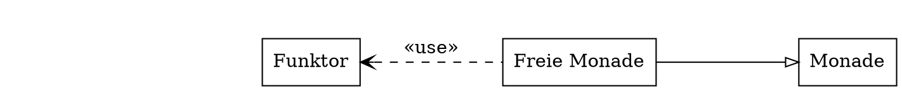
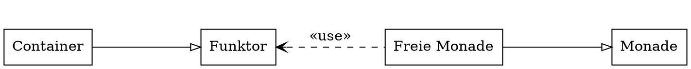
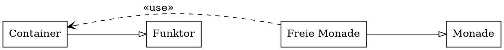

# Motivation

<!--
  - Was ist Coq?
  - Warum Haskell zu Coq übersetzen?
  - Welche Hauptprobleme sind dabei zu lösen?
-->

## Was ist Coq?

::: incremental

- Beweisassistenzsystem
- Funktionalle Spezifikationssprache Gallina
- Extraktion der verifizierten Programme  
  (z.B. Coq → Haskell)

:::

## Haskell → Coq

::: incremental

- Verifikation bestehender Programme
- Beweise aufwendiger als Testen
- Bequemlichkeit

:::

## Hauptherausforderungen {.fragile}

::: incremental

- In Coq müssen alle Funktionen

    + **total** sein <span class="fragment" data-autoslide="1">und</span>

    + **terminieren**

        <div class="fragment">
        ```haskell
        fac :: Int -> Int
        fac n = if n == 0 then 1
                          else n * fac (n - 1)
        ```
        </div>

- Unterschiedliche Auswertungsstrategien

:::

# Existierende Ansätze

<!--
  - Welche Implementierungen existieren bereits?
  - Was sind die Probleme dieser existierenden Implementierungen?
  - Was soll meine Implementierung anders/besser machen?
-->

## [hs-to-coq](https://github.com/antalsz/hs-to-coq) {.fragile}

::: incremental

- Entwickelt an der Universität von Pennsylvania

- Übersetzt **totale** Haskell Programme zu Coq

- Zusätzliche Axiome für partielle Funktionen

    ```coq
    Axiom patternFailure : forall {a}, a .
    ```

:::

## [haskellToCoqCompiler](https://github.com/beje8442/haskellToCoqCompiler) {.fragile}

::: incremental

- Bachlorarbeit aus Flensburg
- Monadische übersetzung nach [Abel et al.](http://www2.tcs.ifi.lmu.de/~abel/haskell05.pdf)
- `Maybe`{.haskell} oder `Identity`{.haskell} Monade
- Prototypische Umsetzung

:::

# Annahmen

<!--
  - Welche Haskell Features sollen unterstützt werden?
-->

## Annahmen {.fragile}

- Zu jeder Funktion wird die **Typsignatur** explizit angegeben.

::: incremental

- Vordefinierte Typen: `Int`{.haskell}, `Bool`{.haskell}, `[a]`{.haskell},
  `()`{.haskell} und `(a, b)`{.haskell}
- Benutzerdefinierte Typen mit `data`{.haskell} und `type`{.haskell},
  aber nicht `newtype`{.haskell}

:::

## Annahmen {.fragile}

- Jede Funktion wird durch **genau eine Regel** definiert.

    ```haskell
    @$f$@ :: @$\tau_1$@ -> @$\ldots$@ -> @$\tau_n$@ -> @$\tau$@
    @$f$@ @$x_1$@ @$\ldots$@ @$x_n$@ = @$e$@
    ```
- Explizites und vollständiges Pattern-Matching

    ```haskell
    case xs of
      []      -> undefined
      x : xs' -> x
    ```

## Annahmen {.fragile}

- Keine `let`{.haskell} oder `do`{.haskell} Ausdrücke

- Keine Typklassen

- Keine `import`{.haskell}s

# Übersetzung

## Beispiel {.fragile}

```haskell
head :: [a] -> a
head (x:_) = x
```

<div class="fragment">
```haskell
head :: [a] -> a
head xs = case xs of
  []    -> undefined
  x:xs' -> x
```
</div>

## Beispiel {.fragile}

```haskell
head :: [a] -> a
head xs = case xs of
  []    -> undefined
  x:xs' -> x
```

<div class="fragment">
```coq
Definition head {a : Type} (xs : List a) : a :=
  match xs with
  | nil        => (* ??? *)
  | cons x xs' => x
  end.
```
</div>

<div class="fragment">
```coq
Definition head {a : Type} (xs : List a) : option a :=
  match xs with
  | nil        => None
  | cons x xs' => Some x
  end.
```
</div>

## Beispiel {.fragile}

<div class="fragment">
```coq
Inductive List (a : Type) : Type :=
  | nil  : List a
  | cons : option a -> option (List a) -> List a.
```
</div>

```coq
Definition head {a : Type} (oxs : option (List a)) : option a :=
  oxs >>= fun(xs : List a) =>
    match xs with
    | nil          => None
    | cons ox oxs' => ox
    end.
```

## Beispiel {.fragile}

```coq
Inductive List (m : Type -> Type) (a : Type) : Type :=
  | nil  : List m a
  | cons : m a -> m (List m a) -> List m a.
```

<div class="fragment">
> Error: Non strictly positive occurrence of "List" in
> "m a -> m (List m a) -> List m a".
</div>

## Freie Monade {.fragile data-transition="slide-in fade-out"}

```haskell
data Free f a = Pure a | Impure (f (Free f a))
```

<div class="fragment">

</div>

## Freie Monade {.fragile data-transition="fade"}

```haskell
data Free f a = Pure a | Impure (f (Free f a))
```



## Freie Monade {.fragile data-transition="fade-in slide-out"}

```haskell
data Free f a = Pure a | Impure (f (Free f a))
```



## Freie Monade {.fragile}

```coq
Inductive List {@$F$@ : Type -> Type} (@$C_F$@ : Container @$F$@)
               (a : Type) :=
  | nil  : List @$C_F$@ a
  | cons : Free @$C_F$@ a -> Free @$C_F$@ (List @$C_F$@ a) -> List @$C_F$@ a.
```

# Ausblick

<!--
  - Aktueller Stand und was noch zu tun ist.
-->

# Fragen?

<!-- Backup slides: -->

# Warum kann man `fac`{.haskell} nicht übersetzen? {.small-heading}

## `fac`{.haskell} über `Int`{.haskell}

```haskell
fac :: Int -> Int
fac n = if n == 0 then 1 else n * fac (n - 1)
```

::: incremental
```haskell
fac (-1) @$\rightarrow$@ (-1) * fac (-2)
         @$\rightarrow$@ 2 * fac (-3)
         @$\rightarrow$@ @$\ldots$@
```
:::

## `fac`{.haskell} über `nat`{.coq}

```haskell
fac :: Int -> Int
fac n = if n == 0 then 1 else n * fac (n - 1)
```

```coq
(* Compiliert nicht, da n nicht strukturell abgebaut wird. *)
Fixpoint fac (n : nat) : nat :=
  if Nat.eqb n 0 then 1 else n * fac (n - 1).
```

## `fac`{.haskell} mit `match`{.coq} {data-transition="slide-in fade-out"}

```haskell
fac :: Int -> Int
fac n = if n == 0 then 1 else n * fac (n - 1)
```

```coq
Fixpoint fac (n : nat) : nat :=
  match n with
  | O    => 1
  | S n' => n * fac n'
  end.
```


## `fac`{.haskell} mit `match`{.coq} {data-transition="fade-in slide-out"}

```haskell
fac :: Int -> Int
fac n = case n of 0          -> 1
                  {- S n' -} -> n * fac {- n' -}
```

```coq
Fixpoint fac (n : nat) : nat :=
  match n with
  | O    => 1
  | S n' => n * fac n'
  end.
```
