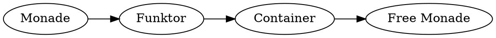

## Gliederung

1. Motivation
2. Existierende Ansätze
3. Mein Ansatz
4. Ausblick

<!-- Force pandoc to include MathJax. -->
<div style="display: none">
$x$
</div>

# Motivation

<!--
  - Was ist Coq?
  - Warum Haskell zu Coq übersetzen?
  - Welche Hauptprobleme sind dabei zu lösen?
-->

# Existierende Ansätze

<!--
  - Welche Implementierungen existieren bereits?
  - Was sind die Probleme dieser existierenden Implementierungen?
  - Was soll meine Implementierung anders/besser machen?
-->

# Annahmen

<!--
  - Welche Haskell Features sollen unterstützt werden?
-->

## Annahmen {.fragile}

- Zu jeder Funktion wird die **Typsignatur** explizit angegeben.

> - Vordefinierte Typen: `Int`{.haskell}, `Bool`{.haskell}, `[a]`{.haskell},
>   `()`{.haskell} und `(a, b)`{.haskell}
> - Benutzerdefinierte Typen mit `data`{.haskell} und `type`{.haskell},
>   aber nicht `newtype`{.haskell}

## Annahmen {.fragile}

- Jede Funktion wird durch **genau eine Regel** definiert.

    ```haskell
    @$f$@ :: @$\tau_1$@ -> @$\ldots$@ -> @$\tau_n$@ -> @$\tau$@
    @$f$@ @$x_1$@ @$\ldots$@ @$x_n$@ = @$e$@
    ```
- Explizites und vollständiges Pattern-Matching

    ```haskell
    case xs of
      []      -> undefined
      x : xs' -> x
    ```

## Annahmen {.fragile}

- Keine `let`{.haskell} oder `do`{.haskell} Ausdrücke

- Keine Typklassen

- Keine `import`{.haskell}s

# Übersetzung

## Beispiel {.fragile}

```haskell
head :: [a] -> a
head (x:_) = x
```

<div class="fragment">
```haskell
head :: [a] -> a
head xs = case xs of
  []    -> undefined
  x:xs' -> x
```
</div>

## Beispiel {.fragile}

```haskell
head :: [a] -> a
head xs = case xs of
  []    -> undefined
  x:xs' -> x
```

<div class="fragment">
```coq
Definition head {a : Type} (xs : List a) : a :=
  match xs with
  | nil        => (* ??? *)
  | cons x xs' => x
  end.
```
</div>

<div class="fragment">
```coq
Definition head {a : Type} (xs : List a) : option a :=
  match xs with
  | nil        => None
  | cons x xs' => Some x
  end.
```
</div>

## Beispiel {.fragile}

<div class="fragment">
```coq
Inductive List (a : Type) : Type :=
  | nil  : List a
  | cons : option a -> option (List a) -> List a.
```
</div>

```coq
Definition head {a : Type} (oxs : option (List a)) : option a :=
  oxs >>= fun(xs : List a) =>
    match xs with
    | nil          => None
    | cons ox oxs' => ox
    end.
```

## Beispiel {.fragile}

```coq
Inductive List (m : Type -> Type) (a : Type) : Type :=
  | nil  : List m a
  | cons : m a -> m (List m a) -> List m a.
```

<div class="fragment" style="font: 60% monospace;">
> Error: Non strictly positive occurrence of "List" in
> "m a -> m (List m a) -> List m a".
</div>

<div class="fragment">

</div>

<div class="fragment">
```coq
Inductive List {@$F$@ : Type -> Type} (@$C_F$@ : Container @$F$@)
               (a : Type) :=
  | nil  : List @$C_F$@ a
  | cons : Free @$C_F$@ a -> Free @$C_F$@ (List @$C_F$@ a) -> List @$C_F$@ a.
```
</div>

# Ausblick

<!--
  - Aktueller Stand und was noch zu tun ist.
-->
